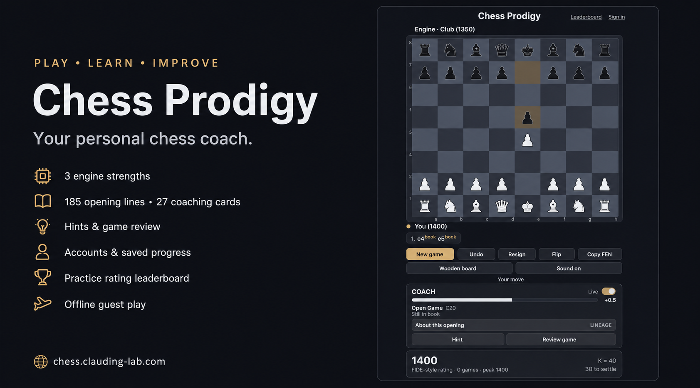

# Chess Prodigy

**[Play Chess Prodigy](https://chess.clauding-lab.com)** · [Releases](https://github.com/clauding-lab/chess-prodigy/releases)

A chess coach you can play in your browser. Practise against three engine strengths, explore opening plans, ask for a hint and review your moves. Play as a guest or create an account to keep your progress across devices.

[](https://chess.clauding-lab.com)

## Features

- Custom chess engine with Casual, Club and Strong levels; calculations run separately so the board stays responsive.
- 185 opening lines and 27 coaching cards, move explanations, hints and game review.
- Untimed games or 5, 10 and 15+10 minute clocks, with promotion, castling, en passant and draw detection.
- Dark board by default, an optional wooden board, keyboard controls, sound and mobile layouts.
- Optional name, email and password accounts with private game records, saved position, practice rating and preferences.
- An in-app leaderboard of player names and practice ratings, after one rated game.
- Guest play works offline after the first successful online load. Updates wait until the active game finishes.

## Accounts and privacy

Create an account from **Sign in**. Use an email address as your login ID and a password of 12–128 characters. Email addresses are not verified and automated forgotten-password recovery is not available; keep your password in a password manager. You can change it while signed in.

Email addresses, game records and password hashes are stored privately on the server. Display names and practice ratings appear on the public leaderboard. Passwords are hashed by Better Auth; they are never stored as readable text. Session cookies are inaccessible to page scripts. The public repository contains source code, not the live database, secrets or player records.

Guest saves and account saves are separate. Signing in does not automatically import or replace a guest game. Accounts retain the most recent 200 completed games. Account progress saves locally first and then synchronizes with the server. If another device has newer progress, the app asks which copy to keep. Watch the save status before switching devices. Login and synchronization require an internet connection.

The rating is a **personal practice rating**, not an official FIDE rating. Hints and takebacks make a game unrated. The server validates saved chess positions but these are not competitive or cheat-proof records. The in-app leaderboard shows display names and practice ratings after at least one rated game. Email addresses and individual game records stay private.

## Play

Choose a colour, strength and time control, then **Start**. Click a piece and its destination, or use the keyboard: Tab enters the board, arrow keys navigate, Enter/Space selects and moves, Escape deselects.

The clock starts after the first move and keeps running while the page is hidden or closed. Starting another game abandons an unfinished rated game as a loss. **Copy FEN** copies the current board position; it is not a full game backup.

Clearing browser data removes local guest progress and unsynchronized changes. An unreadable save is preserved until you explicitly choose **Enable saving** to replace it. Use one playing tab at a time; conflicts are detected but boards do not update live between devices.

## Run locally

Requirements: Node 22.19+ and npm. `.nvmrc` selects the tested version.

```sh
git clone https://github.com/clauding-lab/chess-prodigy.git
cd chess-prodigy
nvm use
npm ci
cp .env.example .env
# Set a random AUTH_SECRET in .env; do not commit it.
npm run build
npm start
```

Open `http://127.0.0.1:4317`. The server creates its SQLite database on first start. For frontend development, run the server and `npm run dev` in separate terminals; see [deployment and configuration](deploy/README.md).

For a frontend-only guest preview:

```sh
npm run dev -- --port 5173
```

Offline installation needs HTTPS or localhost. Account requests are excluded from the offline cache.

## Checks

```sh
npm run typecheck
npm run lint
npm run format:check
npm test
npm run build
npm run test:browser
```

The browser suite exercises desktop and mobile layouts in Chromium. Physical Android/iOS installation and performance checks remain pending; browser emulation does not establish those results. The separate `npm run test:accessibility` runs Lighthouse against a preview on port 4173 (`CHESS_PREVIEW_URL` overrides the address).

## Project map

| Path | Purpose |
| --- | --- |
| `src/engine`, `src/worker` | Chess rules, evaluation and background search |
| `src/book`, `src/coach` | Opening lines and coaching content |
| `src/game`, `src/rating`, `src/storage` | Game transitions, practice rating and validated saves |
| `src/account`, `server` | Account interface, private records and synchronization |
| `src/ui`, `src/App.tsx` | Board and application interface |
| `tests` | Logic, account integration and browser regressions |
| `deploy` | Service configuration, backup and deployment guide |
| `reference` | Original supplied prototype and corrected behavioural reference |

See [CHANGELOG](CHANGELOG.md), [release evidence](docs/verification/release-report.md), [agent instructions](AGENTS.md) and [scope](VISION.md). There is no Stockfish, paid AI or external chess-service dependency.
